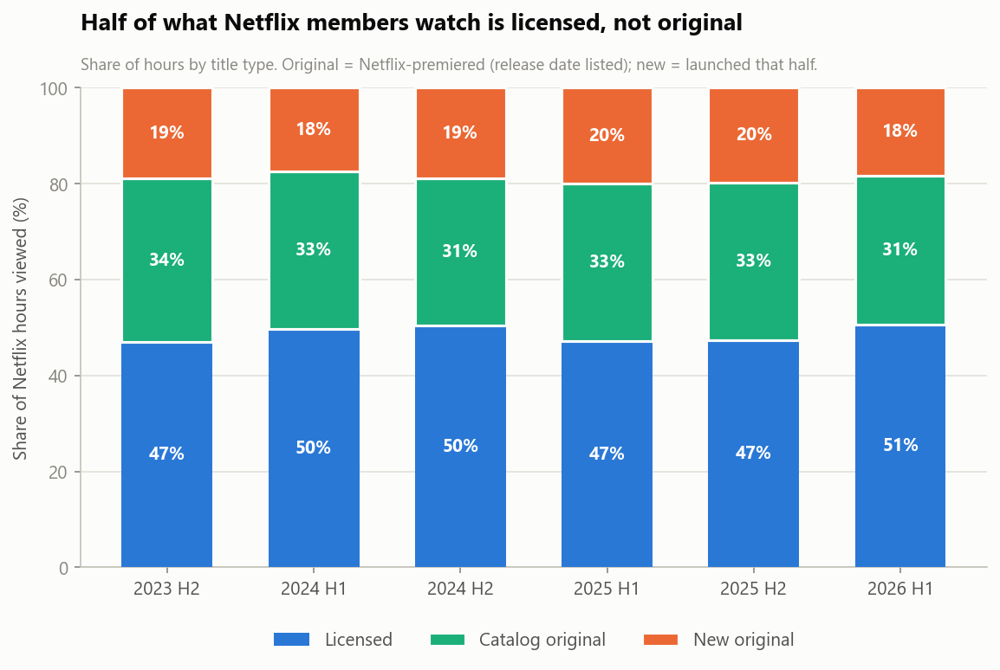
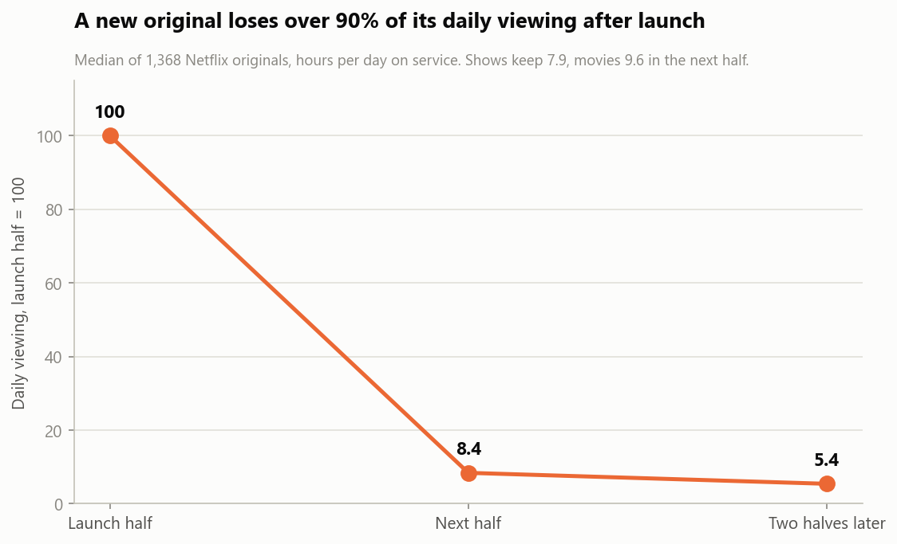
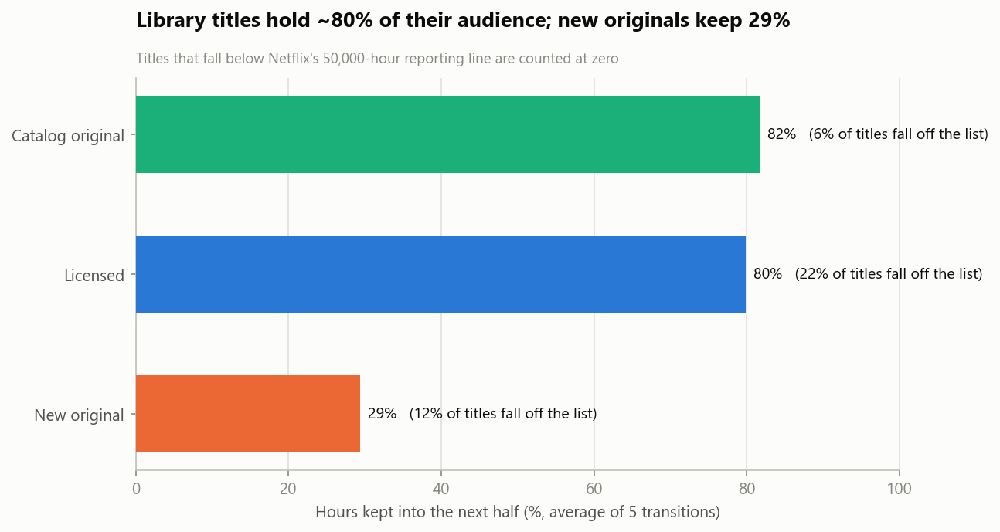
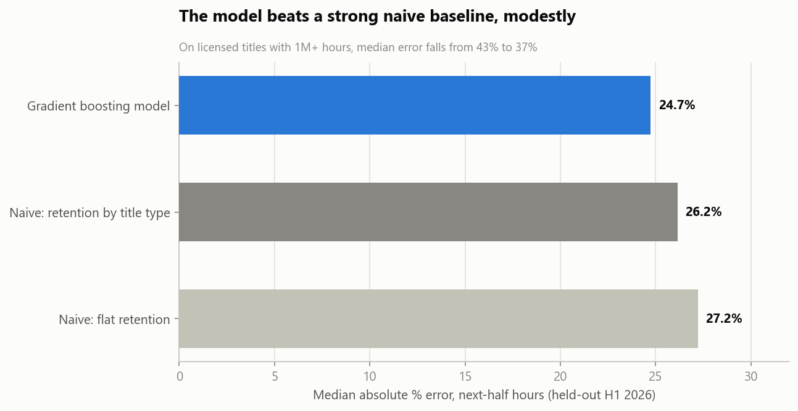

# Streaming Catalog Value

**What is a title actually worth to a streaming catalog?** An analysis of every title in Netflix's public engagement reports, H2 2023 – H1 2026: 97,736 title-period observations covering 28,694 titles.

```bash
pip install -r requirements.txt
python verify.py
```

Downloads Netflix's seven reports (hash-checked), rebuilds every result, and asserts all 10 published figures. About 25 seconds.

Read [MEMO.md](MEMO.md) for the findings.

---

## Headline findings

- **Half of all viewing is licensed.** Licensed titles supply 47–51% of hours in every half; new originals supply 18–20%.
- **Launches fall off a cliff.** A new original's daily viewing drops over 90% after its launch half (median of 1,368 originals).
- **Library titles hold their audience.** Catalog originals keep 82% of their hours half over half, licensed titles 80%, new originals 29%.
- **Licensed titles churn off the service 3.6x as often** as catalog originals (22% vs 6% per half).
- **Fewer than 5% of titles deliver half of all viewing.**
- **Next-half viewing is forecastable:** 24.7% median error on a held-out half, beating two naive baselines. On licensed titles with 1M+ hours, error falls from 43% to 37%.









## Method

| Step | Script | What it does |
|---|---|---|
| 0 | `src/fetch_data.py` | Downloads the seven reports from Netflix's file host and checks each SHA-256 |
| 1 | `src/build_panel.py` | Stacks the reports into a title-by-half panel; computes days on service and hours per day |
| 2 | `src/analysis.py` | Concentration, viewing mix, launch decay, retention by segment, forecasting against baselines |
| 3 | `src/charts.py` | Five charts on a colourblind-safe palette |
| — | `tests/test_claims.py` | Asserts every published figure, including an external check against Netflix's own reported total |

**Choices that matter:**
- **Decay is in hours per day on service.** A title released late in a half isn't penalised for a short launch window.
- **Titles below the 50,000-hour reporting line count as zero.** That makes retention a conservative lower bound, and dropout is reported alongside it.
- **The forecast is conditional on the title staying listed,** because that's what a licensing team is pricing. It's tested on a fully held-out half against a baseline that already knows "launches fade, library holds."

## Data

Netflix, *What We Watched: A Netflix Engagement Report*, published every half-year at [about.netflix.com](https://about.netflix.com/en/news/what-we-watched-the-first-half-of-2026). Each report lists every title watched for 50,000+ hours in the period. The raw files aren't redistributed here; `fetch_data.py` downloads them from Netflix and verifies them.

**Original vs licensed** is inferred from whether Netflix lists a release date, which it does for titles it premiered. It's a proxy, stated as one.

## Requirements

Python 3.10+, `pandas`, `numpy`, `scikit-learn`, `matplotlib`, `openpyxl`, `pyarrow`.

## Limitations

- Hours aren't revenue. There are no license fees or budgets, so titles are valued in viewing, not dollars.
- The original/licensed split is a proxy.
- Six half-years is a short panel, and Netflix moves to annual reports from 2027.

## License

Code is released under the MIT License (see [LICENSE](LICENSE)). The data belongs to its original publishers and keeps its original license; see the sources above.
